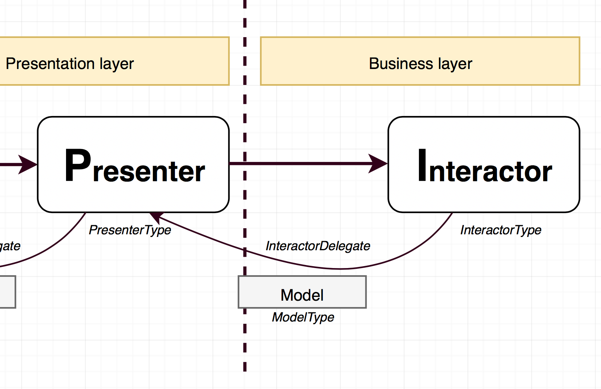

# VIPER-B
### Evaluating clean architecture hype in real app.


# WARNING 

Example may carry **strong** over-architecting symptoms. Please proceed with _caution_!

- Not necessary an expert view, just average dev tryout
- Just another Viper implementation agreements
- Consciously taken to the extreme
- Promised a friend to share an experience one day... (celeryman)


# Genesis

- Starting new big project when Swift 3.0 was in beta
- Disappointed in MVC and MVVM a bit
- Let's try something new


# Inspired by...


# BATMAN


### ... and Uncle Bob


### Nicola Zaghini


!!! Must watch video:

[Mastering reuse: A journey into application modularization with VIPER](https://skillsmatter.com/skillscasts/7931-mastering-reuse-a-
https://skillsmatter.com/skillscasts/7931-mastering-reuse-a-journey-into-application-modularization-with-viper)


# Viper-B was found

- Seemed to answer the most questions
- Very granular
- Clean separation of concerns
- Well defined boundaries of data processing steps and object types (components / models)


# Viper-B module
### Represents user story / use case / feature or screen of content

**Module components**
- **View** - view layer (UIKit / UIViewController)
- **Presenter** & **View model** - presentation layer
- **Interactor** & **Model** - business rules and data model
- **Builder** - builds the module (entry point)
- **Router** - exit point from the module

**Enterprise layer**
- **Data Manager** & **Entity** - an enterprise gateway
- **Service** - data services (database / web)
- **Storage** - represents fast local storage or cache


## Ready to play with some _LEGO_ **BLOCKS**?


# View & Presentation layer


**View:**
- Usually UIViewController subclass
- Simplest `UIKit` code (similar to other patterns, like MVVM)
- Displays view model delivered by presenter (weak delegate)
- Delegates all UI events to presenter

**Presenter:**
- Delivers **ViewModel** to the **VIEW**
- Handles events delivered from the **VIEW**
- An adapter between business logic **INTERACTOR** and UI (**VIEW**)
- Converts **Models** to something displayable (**ViewModel**) and delivers it to the delegate (**VIEW**)
- May call **ROUTER** when decides that view events need to be handled externally
- No `UIKit`

**View model:**
 - Data model generated by **PRESENTER** 
 - Describing UI state for the **VIEW**
 - Simple property types (`String`, `Bool`, `enum`)
 - No `UIKit`


# Business layer



**Interactor**

- A PONSO encapsulating business rules for specific use case.
- Knows what tasks needs to be carried out before returning stuff to the presenter.
- Does not care where data comes from, uses data manager(s) for this.
- Transforms entities into models.
- Can subscribe to events from a data managers
- Api should have very specific methods to meet business tasks.

**Model**

- Encapsulates data model of results coming from **INTERACTOR**.
- Contains raw properties that are interesting for the use case.
- Not suitable for display (presenter's job).


# Enterprise layer


**Entity**
- Enterprise data model.
- Not application specific (e.g. coming from external database scheme or web service)
- Primitives / database-like properties (Int, String)

**Data Manager** (entity Gateway)
- Grouped around domains, e.g. Hero, Image, User
- Encapsulates an API to the enterprise layer (return entities). 
- Per domain (e.g. HeroDataManager, ImageDataManager)
- The data manager knows where to fetch data from and knows if something should be persisted 
- Does not know the underlaying technologies used of storage or service.
- May have multiple subscribed interactors
- Longer life-span

**Service**
- Service to get data from slower resources (network)
- Operates on entities

**Storage**
- Faster, local storage or cache (e.g. NSUserDefaults, CoreData etc)
- Api should be simple and fast


# Builder & Router


**Builder:**
- An ENTRY point to the module.
- Responsible for creating and wiring up Viper module.
- Produces and returns UIViewController retaining the module. 
- Must contain at least one building method.
- UIKit aware

**Router:**
- An EXIT point from the module.
- Takes care of routing from one module to another.
- UIKit


# Ready for full picture?
*...you've been warned!*


# Pros:

- Clear boundaries between layers and data types
- Represents data flow steps and transformation very well
- Promotes composition & protocol oriented design
- Promotes structured code
- Small and specialised classes
- Small files
- Easy to work in teams (not many reasons to change one file)


- Testable
- Teaches you take care about naming conventions (so many files and types ;-)
- Teaches discipline (every time I broke pattern, I had issues with testing)
- Gets intuitive in a while
- Fun (if you like LEGO blocks)


# Cons:

- Ceremony: lots of files and boiler-plate code
- Overkill for some projects (prototyping, etc..)
- Mentally challenging to grasp whole module and track data flow
- Difficult to stay clean at all (lots of conversions, etc...)
- Difficult to stay clean and reuse the code at the same time
- Many files 
- Pain when developing against iOS frameworks (UIKit, Core Data)


# Subjective conclusions:

- A bazooka!
- Definitely worth trying but use with caution
- Don't do it alone!
- Don't get pulled too much into this, use as a guide
- Consider cutting corners (compromise on layer separation)
- Just be SOLID
- Try functional approach?


# Technical issues:

- Swift generics: syntax, circular reference, concrete types requirement

```swift

typealias Presenter = BankListPresenter<BankListRouter, BankListInteractor<BankDataManager>>

```

- Equatable / protocol issues (hacked by type erasure).
- Swift not that'protocol-oriented' after all


# References

Example app GitHub repo: 
[https://github.com/unwire/viper-demo-ios.git](https://github.com/unwire/viper-demo-ios.git)


- [Mastering reuse: A journey into application modularization with VIPER] (https://skillsmatter.com/skillscasts/7931-mastering-reuse-a-journey-into-application-modularization-with-viper)
- [The Principles of Clean Architecture by Uncle Bob Martin] (https://www.youtube.com/watch?v=o_TH-Y78tt4)
- [Brigade’s Experience Using an MVC Alternative] (https://medium.com/brigade-engineering/brigades-experience-using-an-mvc-alternative-36ef1601a41f#.bopro9en4)
- [Architecting Apps with (B)VIPER Modules] (http://www.mttnow.com/blog/architecting-mobile-apps-with-bviper-modules)
- [Architecting iOS Apps with VIPER] (https://www.objc.io/issues/13-architecture/viper/)
- [iOS Architecture Patterns] (https://medium.com/ios-os-x-development/ios-architecture-patterns-ecba4c38de52#.le3733b8o)
- [#8 VIPER to be or not to be?] (https://swifting.io/blog/2016/03/07/8-viper-to-be-or-not-to-be)


