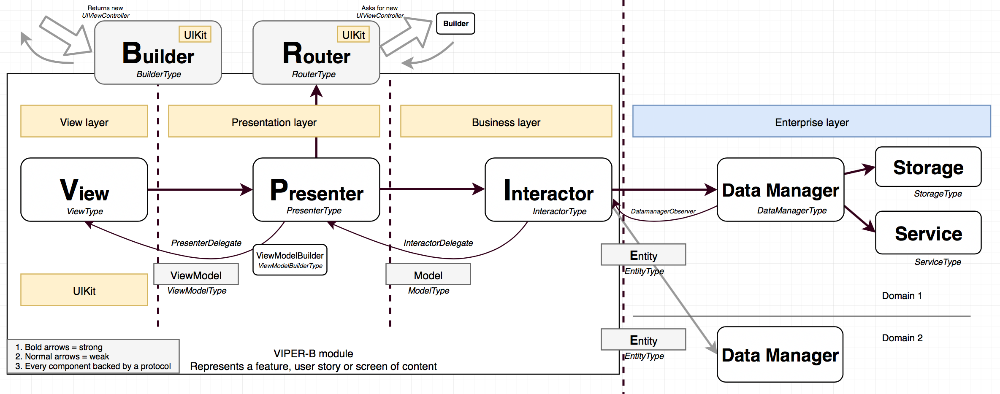
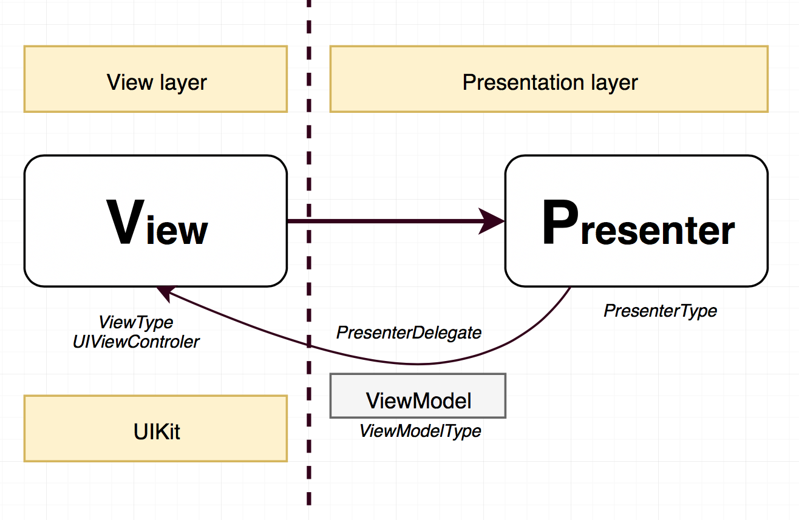
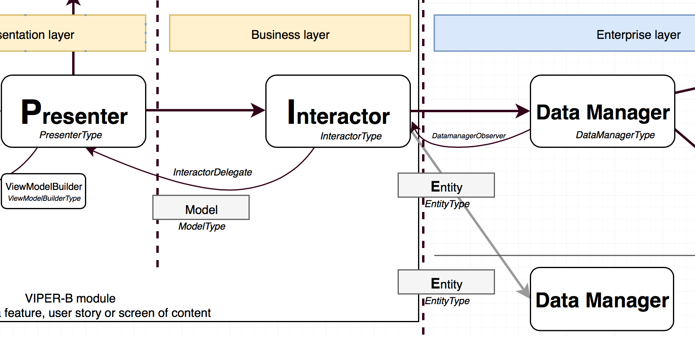
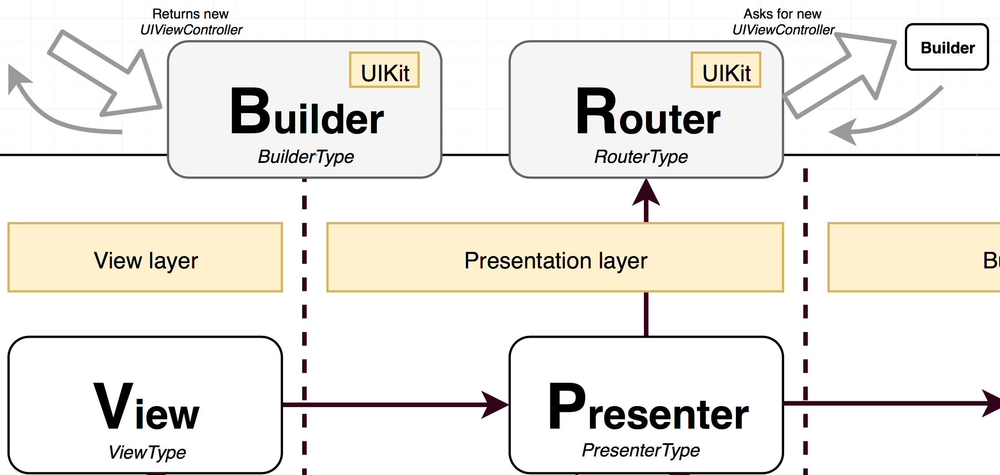

# VIPER-B example application

```
!!! WARNING !!!
Example may contain **strong** symptoms of over-architecture.
Please proceed with _caution_!
```

- Not necessarily an expert view
- Consciously ties to follow clean architecture approach to the extreme

# Inspired by...

### Uncle Bob


### Nicola Zaghini


!!! Must watch video: [Mastering reuse: A journey into application modularization with VIPER](https://skillsmatter.com/skillscasts/7931-mastering-reuse-a-
https://skillsmatter.com/skillscasts/7931-mastering-reuse-a-journey-into-application-modularization-with-viper)


# Why Viper-B?

- Describes components accurately
- Well defined application layers: view, presentation, business, enterprise, routing
- Clear responsibilities and boundaries


# VIPER-B COMPONENTS OVERVIEW:



# VIPER-B LAYERS DIGEST:


## 1. View & Presentation layer



**View:**
- Usually UIViewController subclass
- Simplest `UIKit` code (similar to other patterns, like MVVM)
- Displays view model delivered by presenter (weak delegate)
- Delegates all UI events to presenter

**Presenter:**
- Delivers **ViewModel** to the **VIEW**
- Handles events delivered from the **VIEW**
- An adapter between business logic **INTERACTOR** and UI (**VIEW**)
- Converts **Models** to something displayable (**ViewModel**) and delivers it to the delegate (**VIEW**)
- May call **ROUTER** when decides that view events need to be handled externally
- No `UIKit`

**View model:**
 - Data model generated by **PRESENTER** 
 - Describing UI state for the **VIEW**
 - Simple property types (`String`, `Bool`, `enum`)
 - No `UIKit`


## 2. Business layer



**Interactor**
- A PONSO encapsulating business rules for specific use case.
- Transforms entities into models.
- Knows what tasks needs to be carried out before returning stuff to the presenter.
- Does not care where data comes from, uses data manager(s) for this.
- Does not care about presentation.
- Can subscribe to events from data managers
- Api should have very specific methods to meet business requirements.

**Model**
- Encapsulates data model of results coming from **INTERACTOR**.
- Contains raw properties that are interesting for the use case.
- Not suitable for display (presenter's job).

## 3. Enterprise layer


**Data Manager** (entity Gateway)
- Encapsulates an API to the enterprise layer (returns entities). 
- Grouped around domains, e.g. Hero, Image, User
- The data manager knows where to fetch data from and knows if something should be persisted 
- Does not know the underlaying technologies used for storage or service
- May have multiple subscribed interactors
- Longer life-span

**Entity**
- Enterprise data model.
- Not application specific (e.g. coming from external database scheme or web service)
- Primitives / database-like properties (Int, String)

**Service**
- Service to get data from slower resources (network)
- Operates on entities

**Storage**
- Faster, local storage or cache (e.g. NSUserDefaults, CoreData etc)
- Api should be simple and fast.


## 4. Builder & Router



**Builder:**
- An ENTRY point to the module.
- Responsible for creating and wiring up Viper module.
- Produces and returns UIViewController, retaining the module. 
- Must contain at least one building method.

**Router:**
- An EXIT point from the module.
- Takes care of routing from one module to another.


# Pros:

- Testable
- Small and specialised classes
- Clear boundaries between layers and data types
- Represents data flow steps and transformation very well
- Promotes composition & protocol oriented design
- Promotes structured code
- Facilitates working in teams (not many reasons to change one file)
- Forces you to take care about naming conventions (so many files and types ;-)
- Imposes discipline (every time I broke pattern, I had issues with testing)
- Highlights issues arising from overuse of 3rd party libraries
- Becomes natural, after a while
- Fun (if you like LEGO blocks)
- No singletons!


# Cons:

- Ceremony: lots of files and boiler-plate code
- Overkill for some projects (prototyping, etc..)
- Requires well defined requirements up-front.
- Mentally challenging to grasp whole module and track data flow
- Lots of data model conversions
- Difficult to stay clean and reuse the code at the same time
- Pain to refactor
- Pain when developing against iOS frameworks (UIKit, Core Data)
- Interactors turned out to be not that reusable after all
- Many files
- Changes you...
- Sometimes feels like a dog chasing its tail


# References

- [Mastering reuse: A journey into application modularization with VIPER] (https://skillsmatter.com/skillscasts/7931-mastering-reuse-a-journey-into-application-modularization-with-viper)
- [The Principles of Clean Architecture by Uncle Bob Martin] (https://www.youtube.com/watch?v=o_TH-Y78tt4)
- [Brigade’s Experience Using an MVC Alternative] (https://medium.com/brigade-engineering/brigades-experience-using-an-mvc-alternative-36ef1601a41f#.bopro9en4)
- [Architecting Apps with (B)VIPER Modules] (http://www.mttnow.com/blog/architecting-mobile-apps-with-bviper-modules)
- [Architecting iOS Apps with VIPER] (https://www.objc.io/issues/13-architecture/viper/)
- [iOS Architecture Patterns] (https://medium.com/ios-os-x-development/ios-architecture-patterns-ecba4c38de52#.le3733b8o)
- [#8 VIPER to be or not to be?] (https://swifting.io/blog/2016/03/07/8-viper-to-be-or-not-to-be)


